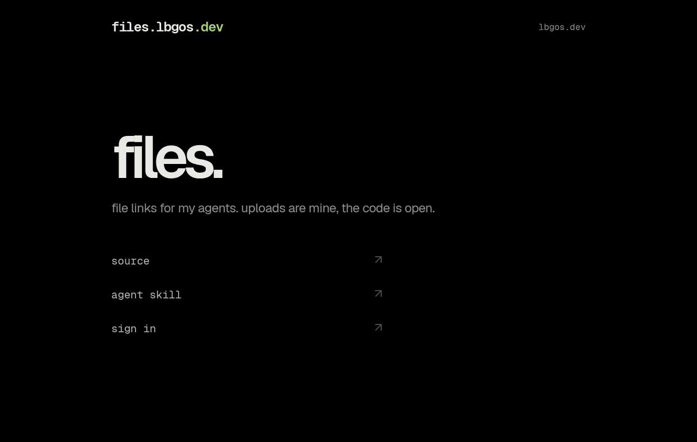

# file-upload

Self-hosted public file links. Upload with a private token and get back an unlisted URL anyone can open.



## Run

```bash
cp .env.example .env    # set FILE_HOST_TOKEN, e.g. from `openssl rand -hex 32`
docker compose up -d --build
```

Open `http://localhost:3000`. Visitors see a short project page. Type the token into its `sign in` row to get the upload page, then drop, paste or choose files. Sign-in sets an HttpOnly session cookie derived from the token for 30 days; rotating the token signs every browser out.

For production, put it behind a reverse proxy. See [deployment](docs/deployment.md).

## API

```bash
# Upload. The response body is the public URL.
curl --fail-with-body -X PUT -T ./recording.webm \
  -H "X-Upload-Token: $FILE_HOST_TOKEN" \
  https://files.example.com/recording.webm
# -> https://files.example.com/f/1e452850091a42cab2b47fe36691651b/recording-a1b2c3d4.webm

# Delete by id.
curl --fail-with-body -X DELETE \
  -H "X-Upload-Token: $FILE_HOST_TOKEN" \
  https://files.example.com/api/files/1e452850091a42cab2b47fe36691651b
```

- Names become ASCII slugs with a random suffix. Ids are 128-bit random.
- Downloads support `Range`, so videos can seek. They also get a sandboxing CSP and `max-age=300`, so a deleted file leaves a CDN cache within minutes.
- The server builds returned URLs from the request's `Host` and `X-Forwarded-Proto`.
- Links are public. Do not upload secrets or sensitive logs.

| Env | Default | Use |
|---|---|---|
| `FILE_HOST_TOKEN` | required | upload and delete token |
| `MAX_FILE_BYTES` | `94371840` (90 MiB) | per-file limit |
| `DATA_DIR` | `/data` | storage root |
| `HOST` / `PORT` | `0.0.0.0` / `3000` | listen address |

## Agent skill

`skill/file-upload` teaches Claude Code or Codex to upload files and embed the links in PRs. Copy it into the agent's skills directory (`~/.claude/skills` or `~/.codex/skills`). Then put the host and token in `~/.config/file-upload.env` with mode `0600`:

```bash
export FILE_HOST_URL='https://files.example.com'   # defaults to https://files.lbgos.dev
export FILE_HOST_TOKEN='<token>'
```

## Develop

Requires Node.js 24 and pnpm 10.

```bash
pnpm install --frozen-lockfile
FILE_HOST_TOKEN=dev DATA_DIR=./data pnpm dev
pnpm check   # typecheck, tests, build
```

## License

MIT
